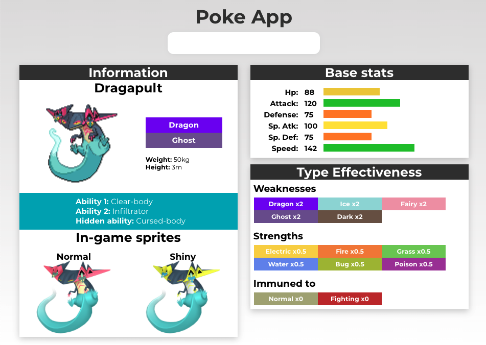

# Pokemon Finder

Enter a pokemon name and renders its type's strengths and weaknesses as well as its stats and other information (sprites, abilities...).

### Technologies used:

- React with React Hooks
- Redux and Redux-Thunk
- Axios

### Screenshot

